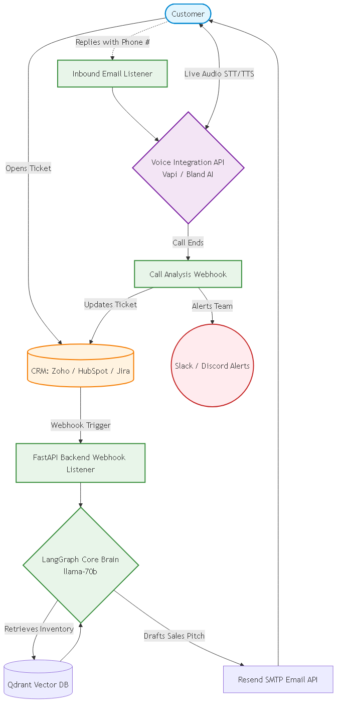

### 9. Custom AI Support & Sales Agent (Automated Ticketing & Live Voice Resolution)
- **The Problem:** Hospitality and Service companies spend massive capital on human agents handling repetitive booking modifications, trip planning inquiries, and low-level support tickets across disconnected platforms (Emails, CRM, Phones).
- **Our Architectural Solution (The 5-Step Automated Workflow):**
  - **1. CRM / Ticketing API Integration:** The agent polls the enterprise CRM (e.g., Zendesk, HubSpot) via API to pull a list of open support tickets and holistic metrics dynamically.
  - **2. Customer Profiling:** The `llama-70b` core brain isolates a specific user (e.g., "Abhishek"), reads their complete historical ticket ledger, and builds a synthesized profile of their current constraints and past friction points.
  - **3. Contextual Email Engine:** Knowing Abhishek wants to book a trip for 3 people, the AI acts as a hybrid sales-support rep. It drafts a highly personalized email recommending specific internal inventory (hotels, pricing) and requests a phone number to finalize details.
  - **4. Live Telephonic Voice Synthesizer:** Upon receiving the phone number, the system triggers a conversational Voice AI API. The AI conducts a live, human-like voice call with Abhishek to dynamically negotiate and resolve the booking entirely over the phone.
  - **5. Automated Closing & Escapation Webhooks:** If the call is successful, the AI updates the CRM ticket notes, closes it, and fires a success Webhook to internal Slack/Discord channels. If Abhishek is frustrated, the AI gracefully escalates the call to a human, updates the ticket with exact failure reasons, and pings the team via Slack to take over.

---

## 🛠️ Step-by-Step Technical Execution & Architecture

### Phase 1: CRM & Ticketing API Integration
To prevent forcing clients to migrate off their existing systems or requiring complex local Role-Based Access Control (RBAC), the Agent operates via secure Webhooks and standard API Authorization credentials.
*   **Identified Enterprise Integrations:**
    *   **Jira Service Management:** Utilizing standard Jira API tokens to push `POST /rest/servicedesk...` updates to close the ticket and append the AI's call transcription as an internal note.
    *   **Zoho Desk:** Integrating the native Zoho Desk `Ticket Update API` to modify status fields and trigger internal Zoho assignment rules to human agents if the customer is dissatisfied.
    *   **HubSpot Service Hub:** Connecting securely via a Private App Access Token to poll for open ticket data (`GET /crm/v3/objects/tickets`) and mutate the pipeline properties.
*   **The Global Mechanism:** 
    *   The client inputs their native CRM API Keys/Tokens into an environment variable configuration UI.
    *   Our FastApi backend leverages a standard `Webhook Listener` to act when they assign a ticket to "AI Processing".
    *   **Architecture Advantage:** We do not need to build internal RBAC or complex user auth loops. We simply pass the payload downstream utilizing their native credentials, significantly speeding up the build time.

### Phase 2: RAG Orchestration & User Profiling
Once a ticket is ingested, it routes through the existing multi-agent brain.
*   **Existing Codebase Utility:** We will heavily utilize the existing `app/supervisor/router.py`. Instead of just parsing a chatbot string, the router now receives a massive stringified JSON blob containing the user's CRM ticket history.
*   **Information Retrieval:** We use our existing `Qdrant` vector database setup (`app/retrieval/`) and `BAAI` cross-encoder to instantly search the enterprise knowledge base for the hotel specs, pricing, and locations that the user desires.
*   **LLM Synthesis:** The heavy `llama-3.3-70b-versatile` model in `app/agents/rag.py` reads the customer history and the retrieved hotel constraints, outputting a formalized, unified profile.

### Phase 3: The Automated Email Dispatcher
The Agent drafts the contextual email without human intervention.
*   **Architecture:** We will write a new `app/integrations/email_smtp.py` module.
*   **Mechanism:** Using the generated profile from Step 2, the AI triggers a prompt asking for the customer's phone number. This text payload is sent via an open-source SMTP library (like Resend or SendGrid API) directly to the customer's inbox.
*   **Listener Logic:** A new FastAPI route `POST /api/v1/webhooks/inbound_email` will listen for the customer's reply. An LLM parses the response, extracts regex numeric phone numbers, and advances the state. 

### Phase 4: Telephonic API Invocation (Voice Engine)
The critical hand-off from text to voice.
*   **The Trigger:** Once the phone number is verified, the State Machine invokes the Voice API.
*   **The Technical Mechanism (Provider Abstraction):** Building a raw WebRTC telephony engine is unfeasible without a strong upfront Telecom budget. We will utilize an abstracted Voice layer that handles the telecom signaling, ultra-low latency STT/TTS routing, and model inference for us. 
    *   **Option 1: Vapi.ai** (Primarily Recommended)
        *   **Capabilities:** Extremely robust function calling. Provides a ~$10 free trial credit (~150 minutes of testing) before switching to standard telecom pricing vectors.
    *   **Option 2: Bland AI**
        *   **Capabilities:** Highly parallelized enterprise calling. Offers a Free Start profile, but standard connection minutes still incur basic telco abstraction costs.
*   **Context Passing:** We cannot just start a blind call. We will construct a massive System Prompt injecting the exact context: *"You are an agent. You represent Hotel X. The user Abhishek wants to stay 3 nights. Their number is 123-456. Try to close the deal."* We dispatch this JSON to the API, which physically dials the number and executes the AI logic live.

### Phase 5: Closing, Escalation, and Notification
The process after the call ends.
*   **Callback Webhook:** The Voice AI provider natively triggers a webhook back to our FastAPI server (`POST /api/v1/webhooks/call_completed`) the second the phone hangs up, containing a complete transcript and an LLM-calculated "success/fail" boolean.
*   **CRM Update Engine:** Our `app/integrations/crm_connector.py` receives this transcript, parses the logical outcome, and fires a POST request back to Zoho/Jira/Hubspot to change the ticket status to either "Resolved" or "Escalate - VIP".
*   **Slack Discord Notification:**
    *   **Architecture:** We will construct `app/integrations/alerts.py`.
    *   Using simple python `requests.post()`, it sends a payload to a pre-defined Slack or Discord Webhook URL.
    *   **Format:** The message includes the Ticket ID, the transcription summary, and immediately alerts the human agents if human intervention was flagged during the live call.
