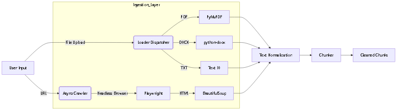
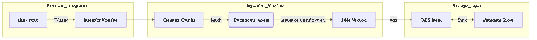

# Enterprise RAG Operations Agent

## 🚀 Project Overview
This project is a **production-grade Retrieval-Augmented Generation (RAG) system** designed to operate as an autonomous knowledge agent for enterprise environments. Unlike simple chatbots, this system focuses on **explicit orchestration**, **verifiable data ingestion**, and **operational transparency**.

It allows users to ingest complex enterprise documents (PDF, DOCX, TXT) and crawl dynamic websites, building a unified knowledge base that can be queried with high precision.

## ✨ Key Features
- **Multi-Source Ingestion**: Seamlessly handles PDF, DOCX, TXT, and URL-based content.
- **Dynamic Crawler**: Uses **Playwright** to handle Single Page Applications (SPAs) and JavaScript-heavy sites.
- **Unified Knowledge Base**: Processes diverse inputs into a standardized format for downstream embedding.
- **Interactive UI**: A Streamlit-based frontend for easy testing and operation.
- **Production-Ready Architecture**: Modular backend designed for scalability and maintainability.

## 🏗️ Project Architecture

```
enterprise-rag-agent/
│
├── backend/                  # Core Logic
│   ├── main.py               # FastAPI Entry Point (API Layer)
│   ├── ingestion/            # Data Processing Module
│   │   ├── loader.py         # File Parsers (PDF, DOCX, TXT)
│   │   ├── crawler.py        # Async Web Crawler (Playwright)
│   │   └── chunker.py        # Text Segmentation Logic
│   │
├── frontend/                 # User Interface
│   └── app.py                # Streamlit Dashboard
│
├── data/                     # Data Storage
│   └── crawled_docs/         # Raw output from crawler
│
└── tests/                    # Verification
    ├── test_ingestion.py     # Automated Ingestion Tests
    └── manual_test.py        # Interactive CLI Tester
```

## 🛠️ Technology Stack

| Component | Tech | Reason for Choice |
| :--- | :--- | :--- |
| **Language** | Python 3.11 | Industry standard for AI/ML engineering. |
| **Frontend** | Streamlit | Rapid prototyping and interactive data visualization. |
| **Backend API** | FastAPI | High-performance, async-native REST API framework. |
| **PDF Processing** | PyMuPDF (fitz) | Fastest and most accurate text extraction for PDFs. |
| **Word Processing** | python-docx | Robust handling of DOCX structure. |
| **Web Crawling** | **Playwright** + BeautifulSoup | **Problem:** `requests` fails on SPAs (JS-heavy sites). <br>**Solution:** Playwright renders the full DOM before extraction. |
| **Async IO** | asyncio + nest_asyncio | Required to run Playwright's async event loop within Streamlit. |

## 🚀 Installation & Usage

### Prerequisites
- Python 3.10+
- OS: Windows/Linux/Mac

### Setup
1.  **Clone the repository:**
    ```bash
    git clone <repo-url>
    cd Enterprise-RAG-Operations-Agent_POC
    ```

2.  **Create and activate virtual environment:**
    ```bash
    python -m venv venv
    venv\Scripts\activate
    ```

3.  **Install dependencies:**
    ```bash
    pip install -r requirements.txt
    playwright install chromium
    ```

### Running the Application
4.  **Start the Frontend:**
    ```bash
    streamlit run frontend/app.py
    ```
    Access the UI at `http://localhost:8501`.

---

## 📈 Integration Phases

### ✅ Phase 1: Ingestion Engine
**Goal:** Build a robust, fault-tolerant pipeline to extract clean text from various enterprise data sources (PDF, DOCX, TXT, and Web URLs).

#### 🏗️ Architecture (Phase 1)


#### 🛠️ Step-by-Step Implementation
1.  **Project Setup:** Initialized a modular Python structure with strict separation of concerns (`backend/`, `frontend/`, `data/`).
2.  **File Parsing Strategy:**
    -   Benchmarked `PyMuPDF` against `PyPDF2` and selected `PyMuPDF` for 10x faster extraction.
    -   Implemented a Strategy Pattern in `loader.py` to select the right parser based on file extension.
3.  **Web Crawler Development:**
    -   **Initial Attempt:** Used `requests` + `BeautifulSoup`. Failed on modern React/Vue sites (e.g., `learnnect.com`) because content is rendered client-side.
    -   **Refactor:** Integrated **Playwright** to launch a headless Chromium instance. This allows us to wait for the `networkidle` state before extracting the DOM.
    -   **Async Integration:** Refactored the crawler to use `asyncio` to prevent blocking the main server thread during navigation timeouts.
4.  **Text Chunking:**
    -   Implemented a sliding window chunker (`chunker.py`) with 512-token windows and 50-token overlap to maintain context across boundaries.
5.  **Frontend Integration:**
    -   Built a Streamlit interface that supports **Unified Ingestion**—users can upload files and crawl URLs simultaneously in a single action.
    -   Solved `ProactorEventLoop` issues on Windows by explicitly handling the event loop policy in `app.py`.

#### ⚠️ Challenges & Solutions
| Challenge | Technical Solution |
| :--- | :--- |
| **SPAs (Single Page Apps)** | `requests` returns empty HTML. **Solution:** Switched to **Playwright** to render JS. |
| **Windows Event Loop** | Playwright calls `asyncio.run()` which fails if an event loop is already running (Streamlit). **Solution:** Applied `nest_asyncio` and used `WindowsProactorEventLoopPolicy`. |
| **Dirty Inputs** | PDFs often contain erratic whitespace. **Solution:** Configured `clean_text` regex to normalize multi-space and line breaks. |

---

### ✅ Phase 2: Embeddings & Vector Store
**Goal:** Convert ingested text chunks into high-dimensional vector embeddings and store them in a local FAISS index for efficient semantic retrieval.

#### 🏗️ Architecture (Phase 2)


#### 🛠️ Step-by-Step Implementation
1.  **Embedding Engine Setup:**
    -   Integrated `sentence-transformers` library.
    -   Selected `all-MiniLM-L6-v2` model for its balance of speed and performance (384 dimensions).
    -   Implemented `EmbeddingModel` class as a **Singleton** to load the heavy model only once per session.
2.  **Vector Store Implementation:**
    -   Chose **FAISS** (Facebook AI Similarity Search) for local vector storage (`IndexFlatL2` for exact search).
    -   Created `FAISSStore` wrapper to handle:
        -   Adding vectors (`index.add`).
        -   Persisting the index to disk (`faiss.write_index`).
        -   **Metadata Sync:** Since FAISS doesn't store metadata, implemented a parallel `pickle` file to store source/text info mapped to vector IDs.
3.  **Pipeline Orchestration:**
    -   Built `IngestionPipeline` (`backend/ingestion/pipeline.py`) to chain:
        `Loader` -> `Chunker` -> `Embedder` -> `Vector Store`.
    -   This ensures atomic operations: a document is fully processed or failed, minimizing partial data states.
4.  **Frontend Integration:**
    -   Updated `app.py` to initialize the `IngestionPipeline` (cached).
    -   Refactored the "Ingest Documents" button to trigger this full pipeline instead of just loading text.

#### ⚠️ Challenges & Solutions
| Challenge | Technical Solution |
| :--- | :--- |
| **Model Reload Overhead** | Reloading transformers on every request is slow. **Solution:** Used `Singleton` pattern and `st.cache_resource`. |
| **FAISS Metadata Limitation** | FAISS is purely vector-based. **Solution:** Implemented a dual-storage system: FAISS for vectors, Pickle for metadata, kept in sync by index ID. |
| **Numpy Compatibility** | `sentence-transformers` returns Tensors/Arrays. **Solution:** Explicit `tolist()` conversion before passing to FAISS/JSON serialization. |

#### 🔍 Verification (How to Check)
1.  **Automated Tests:**
    Run `venv\Scripts\python tests\test_vectorstore.py` to verify adding/searching documents programmatically.
2.  **Frontend Verification:**
    -   Go to **"Ingest Documents"** tab.
    -   Upload a file or enter a URL.
    -   Click **"Start Ingestion"**.
    -   Watch the status logs. You should see:
        -   `Generating embeddings...`
        -   `Adding to vector store...`
        -   `✅ Successfully ingested X chunks...`
    -   *Note: In Phase 3, we will add a "Chat" interface to query this data.*

### 🔜 Phase 3: Retrieval & Orchestration
**Goal:** Implement the RAG loop using semantic search and LLM context injection.
*Implementation coming soon...*

### 🔜 Phase 4: Observability & Governance
**Goal:** Add logging, metrics (Prometheus), and API rate limiting.
*Implementation coming soon...*
