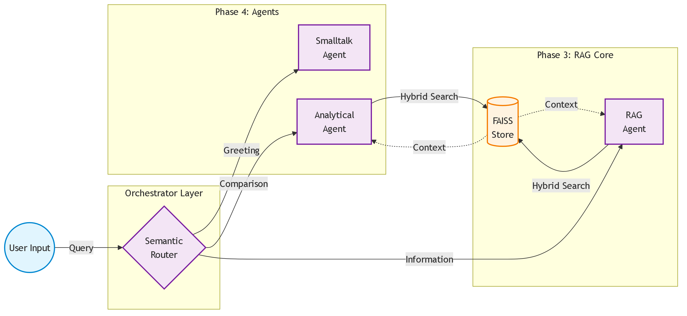

# Enterprise RAG Operations Agent

## 🚀 Project Overview
This project is a **production-grade Retrieval-Augmented Generation (RAG) system** designed to operate as an autonomous knowledge agent for enterprise environments. Unlike simple chatbots, this system focuses on **explicit orchestration**, **verifiable data ingestion**, and **operational transparency**.

It allows users to ingest complex enterprise documents (PDF, DOCX, TXT) and crawl dynamic websites, building a unified knowledge base that can be queried with high precision.

## ✨ Key Features
- **Multi-Agent Orchestration**: Uses LangGraph for robust semantic routing and agent management.
- **Multi-Source Ingestion**: Seamlessly handles PDF, DOCX, TXT, and URL-based content.
- **Dynamic Crawler**: Uses **Playwright** to handle Single Page Applications (SPAs) and JavaScript-heavy sites.
- **Specialized Agents**: Independent RAG, Analytical, and Smalltalk agents to prevent processing bottlenecks and crashes.
- **Interactive UI**: A Streamlit-based frontend for easy testing and operation.

## 🏗️ Project Architecture

```text
enterprise-rag-agent/
│
├── backend/                  # Core Logic
│   ├── main.py               # FastAPI Entry Point (API Layer)
│   ├── agents/               # Autonomous Agents
│   │   ├── base.py           # Base Agent Interface
│   │   ├── analytical.py     # Complex Reasoning Agent
│   │   ├── rag.py            # Grounded QA Agent
│   │   ├── smalltalk.py      # Greeting & Bypass Agent
│   │   ├── supervisor.py     # Semantic Router Agent
│   │   └── tools/
│   │       └── retriever.py  # Standalone FAISS Context Tool
│   ├── embeddings/           # Vector & Embedding logic
│   │   └── embedding_model.py# SentenceTransformers Wrapper
│   ├── generation/           # Legacy/Core Generation Wrappers
│   │   ├── llm_provider.py   # LLM Client (Ollama, Sarvam)
│   │   └── rag_service.py    # UI/Backend Compatibility Wrapper
│   ├── ingestion/            # Data Processing Module
│   │   ├── chunker.py        # Text Segmentation Logic
│   │   ├── crawler.py        # Async Web Crawler (Playwright)
│   │   ├── loader.py         # File Parsers (PDF, DOCX, TXT)
│   │   └── pipeline.py       # Full Ingestion Orchestration Flow
│   ├── orchestrator/         # Graph State Machine
│   │   ├── graph.py          # LangGraph Workflow Construction
│   │   └── state.py          # Global TypedDict Agent State
│   └── vectorstore/          # Vector Storage Module
│       └── faiss_store.py    # Local FAISS Index Engine
│
├── frontend/                 # User Interface
│   └── app.py                # Streamlit Dashboard
│
├── data/                     # Data Storage
│   └── crawled_docs/         # Raw output from crawler
│
└── tests/                    # Verification
```

## 🛠️ Technology Stack

| Component | Tech | Reason for Choice |
| :--- | :--- | :--- |
| **Language** | Python 3.11 | Industry standard for AI/ML engineering. |
| **Orchestration** | LangGraph | State-based multi-agent orchestration for robust NLP routing. |
| **Frontend** | Streamlit | Rapid prototyping and interactive data visualization. |
| **Backend API** | FastAPI | High-performance, async-native REST API framework. |
| **Embeddings** | BAAI/bge-large-en-v1.5 | State-of-the-art open-source embedding model for enterprise use. |
| **Vector Store** | FAISS | High-speed local similarity search. |
| **PDF Processing** | PyMuPDF (fitz) | Fastest and most accurate text extraction for PDFs. |
| **Web Crawling** | **Playwright** + BeautifulSoup | Handles client-side JS rendering for modern SPAs. |

## 🚀 Installation & Usage

### Prerequisites
- Python 3.10+
- OS: Windows/Linux/Mac

### Setup
1.  **Clone the repository:**
    ```bash
    git clone <repo-url>
    cd Enterprise-RAG-Operations-Agent_POC
    ```

2.  **Create and activate virtual environment:**
    ```bash
    python -m venv venv
    venv\Scripts\activate
    ```

3.  **Install dependencies:**
    ```bash
    pip install -r requirements.txt
    playwright install chromium
    ```

4.  **Environment Setup (`.env`):**
    ```env
    SARVAM_API_KEY=your_sarvam_key
    HF_TOKEN=your_huggingface_read_token
    ```

### Running the Application
5.  **Start the Frontend:**
    ```bash
    streamlit run frontend/app.py
    ```
    Access the UI at `http://localhost:8501`.

---

## 📈 Integration Phases

### ✅ Phase 1: Ingestion Engine
**Goal:** Build a robust, fault-tolerant pipeline to extract clean text from various enterprise data sources.
- Benchmarked `PyMuPDF` against `PyPDF2` (10x faster extraction).
- Integrated **Playwright** to launch headless Chromium for complex SPA crawling.
- Implemented sliding window chunking (512-token windows, 50-token overlap).

#### 🏗️ Architecture (Phase 1)


---

### ✅ Phase 2: Embeddings & Vector Store
**Goal:** Convert ingested text chunks into high-dimensional vector embeddings and store them in a local FAISS index.
- Integrated `sentence-transformers` and `BAAI/bge-large-en-v1.5`.
- Created dual-storage system: FAISS for exact vectors, Pickle mapping for metadata.

#### 🏗️ Architecture (Phase 2)


---

### ✅ Phase 3 & 4: Agentic Architecture Overhaul
**Goal:** Remove fragile procedural RAG scripts and replace them with a LangGraph multi-agent orchestrator resilient to logical exceptions.

#### 🏗️ Architecture (Phase 3 & 4)


*(The top section of the diagram illustrates the **Phase 4 Agent Implementations**, including the immediate 0.0s Smalltalk bypass and the high-reasoning Analytical router. The bottom section illustrates the **Phase 3 RAG Agent Refactoring**, decoupling the exact FAISS grounded extraction into an isolated loop.)*

#### 🛠️ Step-by-Step Implementation
1.  **State Management (LangGraph):**
    -   Implemented a global, strictly typed `AgentState` dictionary passing through the graph.
    -   Guarantees variables like `context_text` always exist, permanently solving Python runtime crashes (`UnboundLocalError`).
2.  **Supervisor Semantic Routing:**
    -   Created `SupervisorAgent` using a rigid LLM prompt (Temperature 0.0) to categorize inputs into exact intents (`smalltalk`, `analytical`, `rag`).
    -   Handles catastrophic user typos gracefully (e.g., categorizes "hhi" perfectly as a greeting).
3.  **Specialized Domain Agents:**
    -   **SmalltalkAgent:** Fully bypasses retrieval and generation latency, streaming an instant persona response.
    -   **AnalyticalAgent:** Forces high reasoning effort and creativity (Temperature 0.5+) to logically compare multiple documents.
    -   **RAGAgent:** Standard, grounded RAG using explicit context citation.
4.  **UI Alignment & Optimization:**
    -   Streamlit UI `st.status` dynamically adjusts based on the active agent (e.g., changes from "Analyzing..." to "Agent: Smalltalk").
    -   Silenced upstream framework warnings in the embedding layer (BAAI layer misalignments and HuggingFace throttles).

---

## ⚠️ Challenges & Solutions

A unified log of the engineering hurdles encountered across all phases and the deployed robust solutions:

| Challenge | Phase | Technical Solution |
| :--- | :--- | :--- |
| **SPAs (Single Page Apps)** | Phase 1 | standard `requests` returns empty HTML on React/Vue sites. **Solution:** Switched to **Playwright** to render JS in a virtual DOM. |
| **Windows Event Loop Collision** | Phase 1 | Playwright async calls and Streamlit loops caused thread crashes. **Solution:** Applied `nest_asyncio` and used `WindowsProactorEventLoopPolicy`. |
| **Model Reload Overhead** | Phase 2 | Reloading vector transformers on every request. **Solution:** Used `Singleton` Python pattern and `st.cache_resource`. |
| **Dirty Inputs** | Phase 1/2 | PDFs often contain erratic whitespace. **Solution:** Configured `clean_text` regex to normalize multi-space and line breaks before vectorization. |
| **Retrieval Fallback Crashes** | Phase 3 | Typos leading to zero-result retrieval crashed the server with `UnboundLocalError`. **Solution:** Migrated architecture to a LangGraph state-machine with strict global `AgentState` typing to ensure variables are always instantiated before execution. |
| **Streaming Generator Scope** | Phase 3 | Passing generator streams across agent boundaries. **Solution:** Managed Streamlit `streaming_callback` pointers inside the global Graph state natively, allowing agents to pipe output chunks directly to the UI thread. |
| **Prompt Injection Hallucinations** | Phase 3 | Analytical model hallucinated rules outside the retrieved context. **Solution:** Deployed strict explicit system instruction: *"Never invent rules or criteria that don't exist in the Context"* and forced temperature to `0.5` strictly during analytical routing. |
| **Unauthenticated HF Rate Limits** | Phase 4 | HuggingFace throttled downloading the embedding model. **Solution:** Added `HF_TOKEN` explicitly to `huggingface_hub.login()` at model instantiation. |
| **BAAI Architecture Mismatch** | Phase 4 | Model console spammed with cosmetic `embeddings.position_ids` layer warnings. **Solution:** Added explicit Python `logging` suppression for `transformers.modeling_utils`. |
| **Stale "Analyzing" UI** | Phase 4 | UI showed "Analyzing documents..." even for 0-second instant greetings. **Solution:** Added pre-flight fuzzy matching heuristics to dynamically update `st.status`. |
