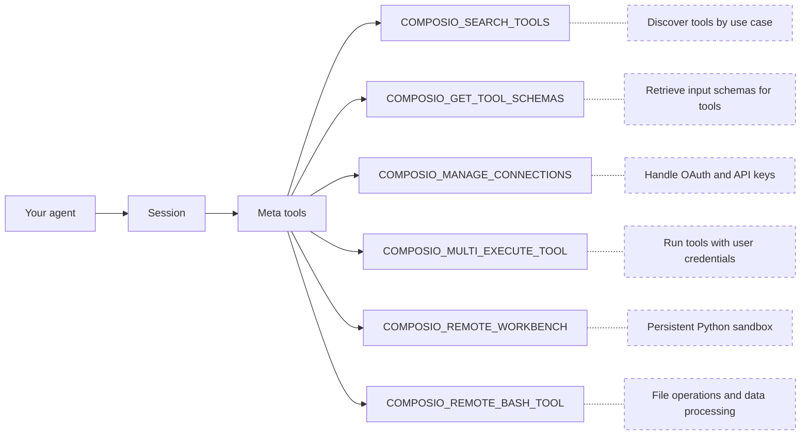

# Python Custom Provider (/docs/providers/custom-providers/python)

This guide shows how to create custom providers for the Composio Python SDK. Custom providers enable compatibility with different AI frameworks and platforms.

# Provider architecture

The Composio SDK uses a provider architecture to adapt tools for different AI frameworks. The provider handles:

1. **Tool format transformation**: Converting Composio tools into formats compatible with specific AI platforms
2. **Platform-specific compatibility**: Providing helper methods for seamless compatibility

# Types of providers

There are two types of providers:

1. **Non-agentic providers**: Transform tools for platforms that don't have their own agency (e.g., OpenAI, Anthropic)
2. **Agentic providers**: Transform tools for platforms that have their own agency (e.g., LangChain, CrewAI)

# Provider class hierarchy

```
BaseProvider (Abstract)
├── NonAgenticProvider (Abstract)
│   └── OpenAIProvider (Concrete)
│   └── AnthropicProvider (Concrete)
│   └── [Your Custom Non-Agentic Provider] (Concrete)
└── AgenticProvider (Abstract)
    └── LangchainProvider (Concrete)
    └── [Your Custom Agentic Provider] (Concrete)
```

# Quick start

The fastest way to create a new provider is using the provider scaffolding script:

```bash
# Create a non-agentic provider
make create-provider name=myprovider

# Create an agentic provider
make create-provider name=myagent agentic=true

# Create provider with custom output directory
make create-provider name=myprovider output=/path/to/custom/dir

# Combine options
make create-provider name=myagent agentic=true output=/my/custom/path
```

This will create a new provider in the specified directory (default: `python/providers/<provider-name>/`) with:

* Complete package structure with `pyproject.toml`
* Provider implementation template
* Demo script
* README with usage examples
* Type annotations and proper inheritance

> The scaffolding script creates a fully functional provider template. You just need to implement the tool transformation logic specific to your platform. You can maintain your provider implementation in your own repository.

## Generated structure

The create-provider script generates the following structure:

```
python/providers/<provider-name>/
├── README.md                    # Documentation and usage examples
├── pyproject.toml              # Project configuration
├── setup.py                    # Setup script for pip compatibility
├── <provider-name>_demo.py     # Demo script showing usage
└── composio_<provider-name>/   # Package directory
    ├── __init__.py             # Package initialization
    ├── provider.py             # Provider implementation
    └── py.typed                # PEP 561 type marker
```

After generation, you can:

1. Navigate to the provider directory: `cd python/providers/<provider-name>`
2. Install in development mode: `uv pip install -e .`
3. Implement your provider logic in `composio_<provider-name>/provider.py`
4. Test with the demo script: `python <provider-name>_demo.py`

# Creating a non-agentic provider

Non-agentic providers inherit from the `NonAgenticProvider` abstract class:

```python
from typing import List, Optional, Sequence, TypeAlias
from composio.core.provider import NonAgenticProvider
from composio.types import Tool, Modifiers, ToolExecutionResponse

# Define your tool format
class MyAITool:
    def __init__(self, name: str, description: str, parameters: dict):
        self.name = name
        self.description = description
        self.parameters = parameters

# Define your tool collection format
MyAIToolCollection: TypeAlias = List[MyAITool]

# Create your provider
class MyAIProvider(NonAgenticProvider[MyAITool, MyAIToolCollection], name="my-ai-platform"):
    """Custom provider for My AI Platform"""

    def wrap_tool(self, tool: Tool) -> MyAITool:
        """Transform a single tool to platform format"""
        return MyAITool(
            name=tool.slug,
            description=tool.description or "",
            parameters={
                "type": "object",
                "properties": tool.input_parameters.get("properties", {}),
                "required": tool.input_parameters.get("required", [])
            }
        )

    def wrap_tools(self, tools: Sequence[Tool]) -> MyAIToolCollection:
        """Transform a collection of tools"""
        return [self.wrap_tool(tool) for tool in tools]

    # Optional: Custom helper methods for your AI platform
    def execute_my_ai_tool_call(
        self,
        user_id: str,
        tool_call: dict,
        modifiers: Optional[Modifiers] = None
    ) -> ToolExecutionResponse:
        """Execute a tool call in your platform's format

        Example usage:
        result = my_provider.execute_my_ai_tool_call(
            user_id="default",
            tool_call={"name": "GITHUB_STAR_REPO", "arguments": {"owner": "composiohq", "repo": "composio"}}
        )
        """
        # Use the built-in execute_tool method
        return self.execute_tool(
            slug=tool_call["name"],
            arguments=tool_call["arguments"],
            modifiers=modifiers,
            user_id=user_id
        )
```

# Creating an agentic provider

Agentic providers inherit from the `AgenticProvider` abstract class:

```python
from typing import Callable, Dict, List, Sequence
from composio.core.provider import AgenticProvider, AgenticProviderExecuteFn
from composio.types import Tool
from my_provider import AgentTool

# Import the Tool/Function class that represents a callable tool for your framework
# Optionally define your custom tool format below
# class AgentTool:
#     def __init__(self, name: str, description: str, execute: Callable, schema: dict):
#         self.name = name
#         self.description = description
#         self.execute = execute
#         self.schema = schema

# Define your tool collection format (typically a List)
AgentToolCollection: TypeAlias = List[AgentTool]

# Create your provider
class MyAgentProvider(AgenticProvider[AgentTool, List[AgentTool]], name="my-agent-platform"):
    """Custom provider for My Agent Platform"""

    def wrap_tool(self, tool: Tool, execute_tool: AgenticProviderExecuteFn) -> AgentTool:
        """Transform a single tool with execute function"""
        def execute_wrapper(**kwargs) -> Dict:
            result = execute_tool(tool.slug, kwargs)
            if not result.get("successful", False):
                raise Exception(result.get("error", "Tool execution failed"))
            return result.get("data", {})

        return AgentTool(
            name=tool.slug,
            description=tool.description or "",
            execute=execute_wrapper,
            schema=tool.input_parameters
        )

    def wrap_tools(
        self,
        tools: Sequence[Tool],
        execute_tool: AgenticProviderExecuteFn
    ) -> AgentToolCollection:
        """Transform a collection of tools with execute function"""
        return [self.wrap_tool(tool, execute_tool) for tool in tools]
```

# Using your custom provider

After creating your provider, use it with the Composio SDK:

## Non-agentic provider example

```python
from composio import Composio
from composio_myai import MyAIProvider
from myai import MyAIClient  # Your AI platform's client

# Initialize tools
myai_client = MyAIClient()
composio = Composio(provider=MyAIProvider())

# Define task
task = "Star a repo composiohq/composio on GitHub"

# Get GitHub tools that are pre-configured
tools = composio.tools.get(user_id="default", toolkits=["GITHUB"])

# Get response from your AI platform (example)
response = myai_client.chat.completions.create(
    model="your-model",
    tools=tools,  # These are in your platform's format
    messages=[
        {"role": "system", "content": "You are a helpful assistant."},
        {"role": "user", "content": task},
    ],
)
print(response)

# Execute the function calls
result = composio.provider.handle_tool_calls(response=response, user_id="default")
print(result)
```

## Agentic provider example

```python
import asyncio
from agents import Agent, Runner
from composio_myagent import MyAgentProvider
from composio import Composio

# Initialize Composio toolset
composio = Composio(provider=MyAgentProvider())

# Get all the tools
tools = composio.tools.get(
    user_id="default",
    tools=["GITHUB_STAR_A_REPOSITORY_FOR_THE_AUTHENTICATED_USER"],
)

# Create an agent with the tools
agent = Agent(
    name="GitHub Agent",
    instructions="You are a helpful assistant that helps users with GitHub tasks.",
    tools=tools,
)

# Run the agent
async def main():
    result = await Runner.run(
        starting_agent=agent,
        input=(
            "Star the repository composiohq/composio on GitHub. If done "
            "successfully, respond with 'Action executed successfully'"
        ),
    )
    print(result.final_output)

asyncio.run(main())
```

# Best practices

1. **Keep providers focused**: Each provider should integrate with one specific platform
2. **Handle errors gracefully**: Catch and transform errors from tool execution
3. **Follow platform conventions**: Adopt naming and structural conventions of the target platform
4. **Use type annotations**: Leverage Python's typing system for better IDE support and documentation
5. **Cache transformed tools**: Store transformed tools when appropriate to improve performance
6. **Add helper methods**: Provide convenient methods for common platform-specific operations
7. **Document your provider**: Include docstrings and usage examples
8. **Set meaningful provider names**: Use the name parameter for telemetry and debugging

---

📚 **More documentation:** [View all docs](https://docs.composio.dev/llms.txt) | [Glossary](https://docs.composio.dev/llms.mdx/docs/glossary) | [Cookbooks](https://docs.composio.dev/llms.mdx/cookbooks) | [API Reference](https://docs.composio.dev/llms.mdx/reference)

---

# Composio SDK — Instructions for AI Code Generators

**Purpose:** Enforce only the **current** and **correct** patterns for integrating [Composio](https://composio.dev/) tools into AI agents.
**Scope:** All AI-generated code using Composio must follow these guardrails.

---

## 1. Correct Composio Integration

Composio supports two integration modes: **Native Tools** (with a provider package) and **MCP** (no provider package needed).

### Native Tools

```python
# ✅ CORRECT — Python (defaults to OpenAI)
from composio import Composio

composio = Composio()
session = composio.create(user_id="user_123")
tools = session.tools()
# Pass tools to your agent/LLM framework
```

```typescript
// ✅ CORRECT — TypeScript (defaults to OpenAI)
import { Composio } from "@composio/core";

const composio = new Composio();
const session = await composio.create("user_123");
const tools = await session.tools();
// Pass tools to your agent/LLM framework
```

For other providers, pass the provider explicitly. Provider packages follow the naming convention: `composio_<provider>` for Python, `@composio/<provider>` for TypeScript.

### MCP

Use `session.mcp.url` and `session.mcp.headers` with any MCP-compatible client (Claude Desktop, Cursor, OpenAI Agents, etc.). No provider package needed.

---

## 2. CRITICAL INSTRUCTIONS FOR AI MODELS

### 2.1 — ALWAYS DO THE FOLLOWING

1. **Use `composio.create(user_id)`** to create a session — this is the entry point for all Composio integrations.
2. **Use `session.tools()`** for native tool integration or **`session.mcp.url`** for MCP integration.
3. **Import** from the correct provider package (`composio_<provider>` for Python, `@composio/<provider>` for TypeScript).
4. **Pass `user_id` to `composio.create()`**, not to individual tool calls.

### 2.2 — NEVER DO THE FOLLOWING

1. **Do not** instruct users to manually create auth configs or connected accounts before running.
2. **Do not** import from `composio_openai` / `@composio/openai` when using OpenAI Agents SDK — use `composio_openai_agents` / `@composio/openai-agents` instead.

### 2.3 — DISCOURAGED (do not use unless user explicitly asks)

Do **not** generate `composio.tools.get()`, `composio.tools.execute()`, or `composio.provider.handle_tool_calls()` unless the user explicitly requests direct tool execution. These are a supported but **not recommended** low-level interface.


---

## Terminology Migration (old → current)

If you encounter these terms in error messages, old documentation, or user prompts, translate them to the current equivalents. **Do not use the old terms in generated code or explanations.**

| Old term (v1/v2) | Current term (v3) | In code |
|---|---|---|
| entity ID | user ID | `user_id` parameter |
| actions | tools | e.g., `GITHUB_CREATE_ISSUE` is a *tool* |
| apps / appType | toolkits | e.g., `github` is a *toolkit* |
| integration / integration ID | auth config / auth config ID | `auth_config_id` parameter |
| connection | connected account | `connected_accounts` namespace |
| ComposioToolSet / OpenAIToolSet | `Composio` class with a provider | `Composio(provider=...)` |
| toolset | provider | e.g., `OpenAIProvider` |

If a user says "entity ID", they mean `user_id`. If they say "integration", they mean "auth config". Always respond using the current terminology.


# How Composio works (/docs/how-composio-works)

Composio connects AI agents to external services like GitHub, Gmail, and Slack. Your agent gets a small set of meta tools that can discover, authenticate, and execute tools across hundreds of apps at runtime.

This page is a high-level overview. Each concept has a dedicated page with full details:

1. [Users & Sessions](/docs/users-and-sessions): how users and sessions scope tools and connections
2. [Authentication](/docs/authentication): Connect Links, OAuth, API keys, and auth configs
3. [Tools and toolkits](/docs/tools-and-toolkits): meta tools, discovery, and execution
4. [Workbench](/docs/workbench): persistent Python sandbox for bulk operations
5. [Triggers](/docs/triggers): event-driven payloads from connected apps

For hands-on setup, see the [quickstart](/docs/quickstart).

# Sessions

When your app calls `composio.create()`, it creates a session scoped to a user.

```python
composio = Composio()
session = composio.create(user_id="user_123")

# Get tools formatted for your provider
tools = session.tools()

# Or get the MCP endpoint for MCP-compatible frameworks
mcp_url = session.mcp.url
mcp_headers = session.mcp.headers
```

A session ties together:

* **A user**: whose credentials and connections to use
* **Available toolkits**: all by default, or a specific set you configure
* **Auth configuration**: which authentication method and connected accounts to use

Sessions are immutable. Their configuration is fixed at creation. If the context changes (different toolkits, different connected account), create a new session. You don't need to cache or manage session IDs.

- [Users & Sessions](/docs/users-and-sessions): How users and sessions scope tools and connections

# Meta tools

Rather than loading hundreds of tool definitions into your agent's context, a session provides [meta tools](/docs/tools-and-toolkits#meta-tools):



The agent searches for relevant tools, authenticates if needed, and executes them, all through these meta tools. For large responses or bulk operations, the agent offloads work to the workbench sandbox. Meta tool calls share context through a `session_id`, so the agent can search in one call and execute in the next without losing state.

Composio also surfaces **learned plans** from past executions: step-by-step workflows that have worked before for similar tasks, guiding the agent without starting from scratch.

- [Tools and toolkits](/docs/tools-and-toolkits): Full details on meta tools, discovery, and execution

# Authentication

When a tool requires authentication and the user hasn't connected yet, the agent uses `COMPOSIO_MANAGE_CONNECTIONS` to generate a **Connect Link**, a hosted page where the user authorizes access.

In a conversation, this looks like:

> **You:** Create a GitHub issue for the login bug
>
> **Agent:** You'll need to connect your GitHub account. Please authorize here: \
>
> **You:** Done
>
> **Agent:** Created issue #42 on your-org/your-repo.

Composio manages the OAuth flow end to end: redirects, token exchange, and automatic refresh. Connections persist across sessions. A user who connects GitHub once can use it in every future session without re-authenticating.

- [Authentication](/docs/authentication): Connect Links, OAuth, API keys, and custom auth configs

# Remote workbench

Large responses from `COMPOSIO_MULTI_EXECUTE_TOOL` are automatically synced to a secure remote workbench. Instead of stuffing thousands of lines into the context window, the agent can work with the data inside the workbench:

* **Reading** files and tool responses
* **Searching** across large outputs
* **Writing and executing** Python code to transform, filter, or aggregate data
* **Calling Composio tools** via the `run_composio_tool` helper for bulk orchestration

This keeps the agent's context window lean while still letting it handle operations like labeling hundreds of emails, processing CSV exports, or summarizing long API responses.

- [Workbench](/docs/workbench): Persistent Python sandbox for large-context operations

# What to read next

Start with the concepts in order, or jump to the quickstart to build right away:

- [Users & Sessions](/docs/users-and-sessions): How users and sessions scope tools and connections

- [Authentication](/docs/authentication): Connect Links, OAuth, API keys, and auth configs

- [Tools and toolkits](/docs/tools-and-toolkits): Meta tools, discovery, and execution

- [Quickstart](/docs/quickstart): Build your first agent

Deciding how to connect? See:

* [Native Tools vs MCP](/docs/native-tools-vs-mcp) — SDK vs MCP servers
* [Sessions vs Direct Execution](/docs/sessions-vs-direct-execution) — meta tools vs fetching specific tools

---

📚 **More documentation:** [View all docs](https://docs.composio.dev/llms.txt) | [Glossary](https://docs.composio.dev/llms.mdx/docs/glossary) | [Cookbooks](https://docs.composio.dev/llms.mdx/cookbooks) | [API Reference](https://docs.composio.dev/llms.mdx/reference)

---

# Composio SDK — Instructions for AI Code Generators

**Purpose:** Enforce only the **current** and **correct** patterns for integrating [Composio](https://composio.dev/) tools into AI agents.
**Scope:** All AI-generated code using Composio must follow these guardrails.

---

## 1. Correct Composio Integration

Composio supports two integration modes: **Native Tools** (with a provider package) and **MCP** (no provider package needed).

### Native Tools

```python
# ✅ CORRECT — Python (defaults to OpenAI)
from composio import Composio

composio = Composio()
session = composio.create(user_id="user_123")
tools = session.tools()
# Pass tools to your agent/LLM framework
```

```typescript
// ✅ CORRECT — TypeScript (defaults to OpenAI)
import { Composio } from "@composio/core";

const composio = new Composio();
const session = await composio.create("user_123");
const tools = await session.tools();
// Pass tools to your agent/LLM framework
```

For other providers, pass the provider explicitly. Provider packages follow the naming convention: `composio_<provider>` for Python, `@composio/<provider>` for TypeScript.

### MCP

Use `session.mcp.url` and `session.mcp.headers` with any MCP-compatible client (Claude Desktop, Cursor, OpenAI Agents, etc.). No provider package needed.

---

## 2. CRITICAL INSTRUCTIONS FOR AI MODELS

### 2.1 — ALWAYS DO THE FOLLOWING

1. **Use `composio.create(user_id)`** to create a session — this is the entry point for all Composio integrations.
2. **Use `session.tools()`** for native tool integration or **`session.mcp.url`** for MCP integration.
3. **Import** from the correct provider package (`composio_<provider>` for Python, `@composio/<provider>` for TypeScript).
4. **Pass `user_id` to `composio.create()`**, not to individual tool calls.

### 2.2 — NEVER DO THE FOLLOWING

1. **Do not** instruct users to manually create auth configs or connected accounts before running.
2. **Do not** import from `composio_openai` / `@composio/openai` when using OpenAI Agents SDK — use `composio_openai_agents` / `@composio/openai-agents` instead.

### 2.3 — DISCOURAGED (do not use unless user explicitly asks)

Do **not** generate `composio.tools.get()`, `composio.tools.execute()`, or `composio.provider.handle_tool_calls()` unless the user explicitly requests direct tool execution. These are a supported but **not recommended** low-level interface.


---

## Terminology Migration (old → current)

If you encounter these terms in error messages, old documentation, or user prompts, translate them to the current equivalents. **Do not use the old terms in generated code or explanations.**

| Old term (v1/v2) | Current term (v3) | In code |
|---|---|---|
| entity ID | user ID | `user_id` parameter |
| actions | tools | e.g., `GITHUB_CREATE_ISSUE` is a *tool* |
| apps / appType | toolkits | e.g., `github` is a *toolkit* |
| integration / integration ID | auth config / auth config ID | `auth_config_id` parameter |
| connection | connected account | `connected_accounts` namespace |
| ComposioToolSet / OpenAIToolSet | `Composio` class with a provider | `Composio(provider=...)` |
| toolset | provider | e.g., `OpenAIProvider` |

If a user says "entity ID", they mean `user_id`. If they say "integration", they mean "auth config". Always respond using the current terminology.


# Tools and toolkits (/docs/tools-and-toolkits)

Composio offers 1000+ toolkits, but loading all the tools into context would overwhelm your agent. Instead, your agent has access to meta tools that discover, authenticate, and execute the right tools at runtime.

# Meta tools

When you create a session, your agent gets these meta tools:

| Meta tool                                                                 | What it does                                                  |
| ------------------------------------------------------------------------- | ------------------------------------------------------------- |
| [`COMPOSIO_SEARCH_TOOLS`](/reference/meta-tools/search_tools)             | Discover relevant tools across 500+ apps with execution plans |
| [`COMPOSIO_GET_TOOL_SCHEMAS`](/reference/meta-tools/get_tool_schemas)     | Retrieve complete input schemas for specific tools            |
| [`COMPOSIO_MULTI_EXECUTE_TOOL`](/reference/meta-tools/multi_execute_tool) | Execute up to 50 tools in parallel                            |
| [`COMPOSIO_MANAGE_CONNECTIONS`](/reference/meta-tools/manage_connections) | Handle OAuth, API key, and other authentication methods       |
| [`COMPOSIO_REMOTE_WORKBENCH`](/reference/meta-tools/remote_workbench)     | Run Python code in a [persistent sandbox](/docs/workbench)    |
| [`COMPOSIO_REMOTE_BASH_TOOL`](/reference/meta-tools/remote_bash_tool)     | Execute bash commands for file and data processing            |

See the [Meta Tools Reference](/reference/meta-tools) for complete input/output schemas and details.

Meta tool calls in a session are correlated using a `session_id`, allowing them to share context. The tools can also store useful information (like IDs and relationships discovered during execution) in memory for subsequent calls.

## How it works

```
User: "Create a GitHub issue for this bug"
    ↓
1. Agent calls COMPOSIO_SEARCH_TOOLS
   → Returns GITHUB_CREATE_ISSUE with input schema
   → Returns connection status: "not connected"
   → Returns execution plan and tips
    ↓
2. Agent calls COMPOSIO_MANAGE_CONNECTIONS (because not connected)
   → Returns auth link for GitHub
   → User clicks link and authenticates
    ↓
3. Agent calls COMPOSIO_MULTI_EXECUTE_TOOL
   → Executes GITHUB_CREATE_ISSUE with arguments
   → Returns the created issue details
    ↓
Done. (For large results, agent can use REMOTE_WORKBENCH to process)
```

## What SEARCH\_TOOLS returns

`COMPOSIO_SEARCH_TOOLS` returns:

* **Tools with schemas** - Matching tools with their slugs, descriptions, and input parameters
* **Connection status** - Whether the user has already authenticated with each toolkit
* **Execution plan** - Recommended steps and common pitfalls for the task
* **Related tools** - Prerequisites, alternatives, and follow-up tools

## Processing large results

For most tasks, `COMPOSIO_MULTI_EXECUTE_TOOL` returns results directly. But when dealing with large responses or bulk operations, your agent uses the workbench tools:

* **`COMPOSIO_REMOTE_WORKBENCH`** - Run Python code in a [persistent sandbox](/docs/workbench). Use for bulk operations (e.g., labeling 100 emails), complex data transformations, or when results need further analysis with helper functions like `invoke_llm`.

* **`COMPOSIO_REMOTE_BASH_TOOL`** - Execute bash commands for simpler file operations and data extraction using tools like `jq`, `awk`, `sed`, and `grep`.

# Toolkits and tools

A **toolkit** is a collection of related tools for a service. For example, the `github` toolkit contains tools for creating issues, managing pull requests, and starring repositories.

A **tool** is an individual action your agent can execute. Each tool has an input schema (required and optional parameters) and an output schema (what it returns). Tools follow a `{TOOLKIT}_{ACTION}` naming pattern, like `GITHUB_CREATE_ISSUE`.

> If you know exactly which tools you need, you can [execute them directly](/docs/tools-direct/executing-tools) without meta tools.

# Default toolkit access

**What toolkits can my agent access by default?**

All of them. When you create a session without specifying a `toolkits` parameter, every toolkit in the Composio catalog is discoverable through `COMPOSIO_SEARCH_TOOLS`. The agent searches for relevant tools at runtime — it doesn't load them all into context at once.

To restrict which toolkits are available, pass `toolkits` when creating the session. See [Enable and disable toolkits](/docs/toolkits/enable-and-disable-toolkits).

# Authentication

Tools execute with the user's authenticated credentials. When a user connects their GitHub account, all GitHub tools run with their permissions.

If a tool requires authentication and the user hasn't connected yet, the agent can use `COMPOSIO_MANAGE_CONNECTIONS` to prompt them.

- [Authentication](/docs/authentication): Persistent Python sandbox for bulk operations and data processing

- [Browse toolkits](/toolkits): Explore all available toolkits

- [Fetching tools](/docs/toolkits/fetching-tools-and-toolkits): Browse the catalog and fetch tools for sessions

- [Direct tool execution](/docs/tools-direct/executing-tools): Execute tools without meta tools for deterministic workflows

---

📚 **More documentation:** [View all docs](https://docs.composio.dev/llms.txt) | [Glossary](https://docs.composio.dev/llms.mdx/docs/glossary) | [Cookbooks](https://docs.composio.dev/llms.mdx/cookbooks) | [API Reference](https://docs.composio.dev/llms.mdx/reference)

---

# Composio SDK — Instructions for AI Code Generators

**Purpose:** Enforce only the **current** and **correct** patterns for integrating [Composio](https://composio.dev/) tools into AI agents.
**Scope:** All AI-generated code using Composio must follow these guardrails.

---

## 1. Correct Composio Integration

Composio supports two integration modes: **Native Tools** (with a provider package) and **MCP** (no provider package needed).

### Native Tools

```python
# ✅ CORRECT — Python (defaults to OpenAI)
from composio import Composio

composio = Composio()
session = composio.create(user_id="user_123")
tools = session.tools()
# Pass tools to your agent/LLM framework
```

```typescript
// ✅ CORRECT — TypeScript (defaults to OpenAI)
import { Composio } from "@composio/core";

const composio = new Composio();
const session = await composio.create("user_123");
const tools = await session.tools();
// Pass tools to your agent/LLM framework
```

For other providers, pass the provider explicitly. Provider packages follow the naming convention: `composio_<provider>` for Python, `@composio/<provider>` for TypeScript.

### MCP

Use `session.mcp.url` and `session.mcp.headers` with any MCP-compatible client (Claude Desktop, Cursor, OpenAI Agents, etc.). No provider package needed.

---

## 2. CRITICAL INSTRUCTIONS FOR AI MODELS

### 2.1 — ALWAYS DO THE FOLLOWING

1. **Use `composio.create(user_id)`** to create a session — this is the entry point for all Composio integrations.
2. **Use `session.tools()`** for native tool integration or **`session.mcp.url`** for MCP integration.
3. **Import** from the correct provider package (`composio_<provider>` for Python, `@composio/<provider>` for TypeScript).
4. **Pass `user_id` to `composio.create()`**, not to individual tool calls.

### 2.2 — NEVER DO THE FOLLOWING

1. **Do not** instruct users to manually create auth configs or connected accounts before running.
2. **Do not** import from `composio_openai` / `@composio/openai` when using OpenAI Agents SDK — use `composio_openai_agents` / `@composio/openai-agents` instead.

### 2.3 — DISCOURAGED (do not use unless user explicitly asks)

Do **not** generate `composio.tools.get()`, `composio.tools.execute()`, or `composio.provider.handle_tool_calls()` unless the user explicitly requests direct tool execution. These are a supported but **not recommended** low-level interface.


---

## Terminology Migration (old → current)

If you encounter these terms in error messages, old documentation, or user prompts, translate them to the current equivalents. **Do not use the old terms in generated code or explanations.**

| Old term (v1/v2) | Current term (v3) | In code |
|---|---|---|
| entity ID | user ID | `user_id` parameter |
| actions | tools | e.g., `GITHUB_CREATE_ISSUE` is a *tool* |
| apps / appType | toolkits | e.g., `github` is a *toolkit* |
| integration / integration ID | auth config / auth config ID | `auth_config_id` parameter |
| connection | connected account | `connected_accounts` namespace |
| ComposioToolSet / OpenAIToolSet | `Composio` class with a provider | `Composio(provider=...)` |
| toolset | provider | e.g., `OpenAIProvider` |

If a user says "entity ID", they mean `user_id`. If they say "integration", they mean "auth config". Always respond using the current terminology.


# Fetching tools and toolkits (/docs/toolkits/fetching-tools-and-toolkits)

# Fetching for a session

When using sessions, fetch tools through the session object.

## List enabled toolkits

`session.toolkits()` returns toolkits enabled for your session, sorted by popularity. By default, it returns the top 20. Each toolkit includes its `slug`, `name`, `logo`, and connection status.

**Python:**

```python
session = composio.create(user_id="user_123")

result = session.toolkits()

for toolkit in result.items:
    print(f"{toolkit.name}: connected={toolkit.connection.is_active if toolkit.connection else 'n/a'}")
```

**TypeScript:**

```typescript
import { Composio } from '@composio/core';
const composio = new Composio({ apiKey: 'your_api_key' });
const session = await composio.create("user_123");

const result = await session.toolkits();

for (const toolkit of result.items) {
  console.log(`${toolkit.name}: connected=${toolkit.connection?.isActive ?? 'n/a'}`);
}
```

You can filter to only show connected toolkits:

**Python:**

```python
connected = session.toolkits(is_connected=True)  # Only connected
```

**TypeScript:**

```typescript
import { Composio } from '@composio/core';
const composio = new Composio({ apiKey: 'your_api_key' });
const session = await composio.create("user_123");
const connected = await session.toolkits({ isConnected: true });  // Only connected
```

To fetch all toolkits, paginate through the results:

**Python:**

```python
all_toolkits = []
cursor = None

while True:
    result = session.toolkits(limit=20, next_cursor=cursor)
    all_toolkits.extend(result.items)
    cursor = result.next_cursor
    if not cursor:
        break
```

**TypeScript:**

```typescript
import { Composio } from '@composio/core';
const composio = new Composio({ apiKey: 'your_api_key' });
const session = await composio.create("user_123");
const allToolkits: any[] = [];
let cursor: string | undefined;

do {
  const { items, nextCursor } = await session.toolkits({ limit: 20, nextCursor: cursor });
  allToolkits.push(...items);
  cursor = nextCursor;
} while (cursor);
```

## Get meta tools

`session.tools()` returns the [meta tools](/reference/meta-tools) formatted for your configured provider (OpenAI, Anthropic, etc.):

**Python:**

```python
# Get all meta tools
tools = session.tools()
```

**TypeScript:**

```typescript
import { Composio } from '@composio/core';
const composio = new Composio({ apiKey: 'your_api_key' });
const session = await composio.create("user_123");
// Get all meta tools
const tools = await session.tools();
```

To restrict which toolkits or tools are discoverable by the meta tools, configure them when [creating the session](/docs/toolkits/enable-and-disable-toolkits).

# Browsing the catalog

Before configuring a session, you may want to explore what toolkits and tools are available. You can browse visually at [platform.composio.dev](https://platform.composio.dev) or in the [docs](/toolkits), or fetch programmatically:

**Python:**

```python
# List toolkits
toolkits = composio.toolkits.get()

# List tools within a toolkit (top 20 by default)
tools = composio.tools.get("user_123", toolkits=["GITHUB"])
```

**TypeScript:**

```typescript
import { Composio } from '@composio/core';
const composio = new Composio({ apiKey: 'your_api_key' });
const userId = 'user_123';
// List toolkits
const toolkits = await composio.toolkits.get();

// List tools within a toolkit (top 20 by default)
const tools = await composio.tools.get(userId, { toolkits: ["GITHUB"] });
```

## Get a tool's schema

To inspect a tool's input parameters and types without needing a user context, use `getRawComposioToolBySlug`:

**Python:**

```python
tool = composio.tools.get_raw_composio_tool_by_slug("GMAIL_SEND_EMAIL")
print(tool.name)
print(tool.description)
print(tool.input_parameters)
print(tool.output_parameters)
```

**TypeScript:**

```typescript
import { Composio } from '@composio/core';
const composio = new Composio({ apiKey: 'your_api_key' });
const tool = await composio.tools.getRawComposioToolBySlug("GMAIL_SEND_EMAIL");
console.log(tool.name);
console.log(tool.description);
console.log(tool.inputParameters);
console.log(tool.outputParameters);
```

# What to read next

- [Enable & disable toolkits](/docs/toolkits/enable-and-disable-toolkits): Control which toolkits and individual tools are available in sessions

- [Tools and toolkits](/docs/tools-and-toolkits): How meta tools discover, authenticate, and execute tools at runtime

- [Browse toolkits](/toolkits): Explore all available toolkits and their tools

---

📚 **More documentation:** [View all docs](https://docs.composio.dev/llms.txt) | [Glossary](https://docs.composio.dev/llms.mdx/docs/glossary) | [Cookbooks](https://docs.composio.dev/llms.mdx/cookbooks) | [API Reference](https://docs.composio.dev/llms.mdx/reference)

---

# Composio SDK — Instructions for AI Code Generators

**Purpose:** Enforce only the **current** and **correct** patterns for integrating [Composio](https://composio.dev/) tools into AI agents.
**Scope:** All AI-generated code using Composio must follow these guardrails.

---

## 1. Correct Composio Integration

Composio supports two integration modes: **Native Tools** (with a provider package) and **MCP** (no provider package needed).

### Native Tools

```python
# ✅ CORRECT — Python (defaults to OpenAI)
from composio import Composio

composio = Composio()
session = composio.create(user_id="user_123")
tools = session.tools()
# Pass tools to your agent/LLM framework
```

```typescript
// ✅ CORRECT — TypeScript (defaults to OpenAI)
import { Composio } from "@composio/core";

const composio = new Composio();
const session = await composio.create("user_123");
const tools = await session.tools();
// Pass tools to your agent/LLM framework
```

For other providers, pass the provider explicitly. Provider packages follow the naming convention: `composio_<provider>` for Python, `@composio/<provider>` for TypeScript.

### MCP

Use `session.mcp.url` and `session.mcp.headers` with any MCP-compatible client (Claude Desktop, Cursor, OpenAI Agents, etc.). No provider package needed.

---

## 2. CRITICAL INSTRUCTIONS FOR AI MODELS

### 2.1 — ALWAYS DO THE FOLLOWING

1. **Use `composio.create(user_id)`** to create a session — this is the entry point for all Composio integrations.
2. **Use `session.tools()`** for native tool integration or **`session.mcp.url`** for MCP integration.
3. **Import** from the correct provider package (`composio_<provider>` for Python, `@composio/<provider>` for TypeScript).
4. **Pass `user_id` to `composio.create()`**, not to individual tool calls.

### 2.2 — NEVER DO THE FOLLOWING

1. **Do not** instruct users to manually create auth configs or connected accounts before running.
2. **Do not** import from `composio_openai` / `@composio/openai` when using OpenAI Agents SDK — use `composio_openai_agents` / `@composio/openai-agents` instead.

### 2.3 — DISCOURAGED (do not use unless user explicitly asks)

Do **not** generate `composio.tools.get()`, `composio.tools.execute()`, or `composio.provider.handle_tool_calls()` unless the user explicitly requests direct tool execution. These are a supported but **not recommended** low-level interface.


---

## Terminology Migration (old → current)

If you encounter these terms in error messages, old documentation, or user prompts, translate them to the current equivalents. **Do not use the old terms in generated code or explanations.**

| Old term (v1/v2) | Current term (v3) | In code |
|---|---|---|
| entity ID | user ID | `user_id` parameter |
| actions | tools | e.g., `GITHUB_CREATE_ISSUE` is a *tool* |
| apps / appType | toolkits | e.g., `github` is a *toolkit* |
| integration / integration ID | auth config / auth config ID | `auth_config_id` parameter |
| connection | connected account | `connected_accounts` namespace |
| ComposioToolSet / OpenAIToolSet | `Composio` class with a provider | `Composio(provider=...)` |
| toolset | provider | e.g., `OpenAIProvider` |

If a user says "entity ID", they mean `user_id`. If they say "integration", they mean "auth config". Always respond using the current terminology.


# When to use your own developer credentials (/docs/custom-app-vs-managed-app)

Composio supports two ways to authenticate users with toolkits.

* **Composio managed apps**: Composio registers and maintains OAuth apps for popular toolkits (GitHub, Gmail, Slack, etc.). Zero setup, works out of the box.
* **Your own OAuth apps**: You register an OAuth app in the toolkit's developer portal and tell Composio to use your credentials instead.

# When to use Composio managed apps

Managed apps are the default. Every toolkit that supports OAuth has a Composio managed app ready to go. Use them when:

* **You're building and iterating.** No OAuth app registration, no credentials to manage. Create a session and start testing immediately.
* **Default scopes cover your needs.** Composio requests sensible defaults for each toolkit.
* **Branding on consent screens doesn't matter yet.** Users will see "Composio wants to access your account" during OAuth. Fine for internal tools, prototypes, and development. You can still [white-label the Connect Link page](/docs/white-labeling-authentication#customizing-the-connect-link) with your logo and app title without needing your own OAuth app.

# When to use your own OAuth app

Bring your own credentials when any of these apply:

* **Your users see OAuth consent screens.** In production, users should see your app name, not "Composio." This is the most common reason to switch.
* **You need custom scopes.** Composio's default scopes may not include everything you need (e.g., write access to a specific Google API).
* **You're hitting rate limits.** Managed apps share quota across all Composio users. Your own app gets a dedicated quota.
* **You're connecting to a custom instance.** Self-hosted or regional variants (e.g., a private Salesforce subdomain) need their own OAuth app.
* **Enterprise customers require your branding end-to-end.**

#### Register an OAuth app with the toolkit

Go to the toolkit's developer portal and register a new OAuth app. You'll need to set the authorized redirect URI to:

```
https://backend.composio.dev/api/v3/toolkits/auth/callback
```

Once registered, copy your **Client ID** and **Client Secret**.

Step-by-step guides for popular toolkits: [Google](https://composio.dev/auth/googleapps) | [GitHub](https://composio.dev/auth/github) | [Slack](https://composio.dev/auth/slack) | [HubSpot](https://composio.dev/auth/hubspot) | [All toolkits](https://composio.dev/auth)

#### Create a custom auth config in Composio

In the [Composio dashboard](https://platform.composio.dev):

    1. Go to **Authentication management** and click **Create Auth Config**
    2. Select the toolkit (e.g., GitHub)
    3. Choose the **OAuth2** scheme
    4. Toggle on **Use your own developer credentials**
    5. Enter your **Client ID** and **Client Secret**
    6. Click **Create**

Copy the auth config ID (e.g., `ac_1234abcd`).

#### Pass the auth config ID in your session

**Python:**

```python
from composio import Composio

composio = Composio()
session = composio.create(
    user_id="user_123",
    auth_configs={
        "github": "ac_your_github_config",
        # toolkits not listed here still use Composio managed auth
    },
)
```

**TypeScript:**

```typescript
import { Composio } from '@composio/core';

const composio = new Composio();
const session = await composio.create("user_123", {
  authConfigs: {
    github: "ac_your_github_config",
    // toolkits not listed here still use Composio managed auth
  },
});
```

# Mixing per toolkit

You don't have to pick one approach for all toolkits. Use your own credentials for toolkits where users see consent screens (GitHub, Google, Slack) and Composio managed auth for the rest. Each toolkit gets its own auth config independently.

**Python:**

```python
session = composio.create(
    user_id="user_123",
    auth_configs={
        "github": "ac_your_github_config",
        "google": "ac_your_google_config",
        # everything else uses Composio managed auth automatically
    },
)
```

**TypeScript:**

```typescript
import { Composio } from '@composio/core';
const composio = new Composio();
const session = await composio.create("user_123", {
  authConfigs: {
    github: "ac_your_github_config",
    google: "ac_your_google_config",
    // everything else uses Composio managed auth automatically
  },
});
```

## Moving from managed to custom

Start with managed apps during development. When you're ready for production, register your own OAuth apps for the toolkits that matter and add the `auth_configs` parameter. No other code changes needed.

If your users already have connections through Composio managed auth, you can import their existing tokens into your new auth config. See [Importing existing connections](/docs/importing-existing-connections).

## Toolkits without managed auth

Some toolkits don't have Composio managed auth. For these, you must create a custom auth config with your own credentials. You can check whether a toolkit has managed auth by calling the API:

```bash
curl 'https://backend.composio.dev/api/v3/toolkits/posthog' \
  -H 'x-api-key: YOUR_API_KEY'
```

If the `composio_managed_auth_schemes` array is empty, you'll need to provide your own credentials. Browse the full list on the [managed auth page](/toolkits/managed-auth) or check individual toolkit pages on the [toolkits page](/toolkits). See [Using custom auth configuration](/docs/using-custom-auth-configuration) for a step-by-step walkthrough.

# What to read next

- [Custom auth configs](/docs/auth-configuration/custom-auth-configs): Detailed setup for custom OAuth apps, API keys, and other auth types

- [White-labeling authentication](/docs/white-labeling-authentication): Remove all Composio branding from your auth flows

- [Programmatic auth configs](/docs/auth-configuration/programmatic-auth-configs): Create and manage auth configs via the SDK

---

📚 **More documentation:** [View all docs](https://docs.composio.dev/llms.txt) | [Glossary](https://docs.composio.dev/llms.mdx/docs/glossary) | [Cookbooks](https://docs.composio.dev/llms.mdx/cookbooks) | [API Reference](https://docs.composio.dev/llms.mdx/reference)

---

# Composio SDK — Instructions for AI Code Generators

**Purpose:** Enforce only the **current** and **correct** patterns for integrating [Composio](https://composio.dev/) tools into AI agents.
**Scope:** All AI-generated code using Composio must follow these guardrails.

---

## 1. Correct Composio Integration

Composio supports two integration modes: **Native Tools** (with a provider package) and **MCP** (no provider package needed).

### Native Tools

```python
# ✅ CORRECT — Python (defaults to OpenAI)
from composio import Composio

composio = Composio()
session = composio.create(user_id="user_123")
tools = session.tools()
# Pass tools to your agent/LLM framework
```

```typescript
// ✅ CORRECT — TypeScript (defaults to OpenAI)
import { Composio } from "@composio/core";

const composio = new Composio();
const session = await composio.create("user_123");
const tools = await session.tools();
// Pass tools to your agent/LLM framework
```

For other providers, pass the provider explicitly. Provider packages follow the naming convention: `composio_<provider>` for Python, `@composio/<provider>` for TypeScript.

### MCP

Use `session.mcp.url` and `session.mcp.headers` with any MCP-compatible client (Claude Desktop, Cursor, OpenAI Agents, etc.). No provider package needed.

---

## 2. CRITICAL INSTRUCTIONS FOR AI MODELS

### 2.1 — ALWAYS DO THE FOLLOWING

1. **Use `composio.create(user_id)`** to create a session — this is the entry point for all Composio integrations.
2. **Use `session.tools()`** for native tool integration or **`session.mcp.url`** for MCP integration.
3. **Import** from the correct provider package (`composio_<provider>` for Python, `@composio/<provider>` for TypeScript).
4. **Pass `user_id` to `composio.create()`**, not to individual tool calls.

### 2.2 — NEVER DO THE FOLLOWING

1. **Do not** instruct users to manually create auth configs or connected accounts before running.
2. **Do not** import from `composio_openai` / `@composio/openai` when using OpenAI Agents SDK — use `composio_openai_agents` / `@composio/openai-agents` instead.

### 2.3 — DISCOURAGED (do not use unless user explicitly asks)

Do **not** generate `composio.tools.get()`, `composio.tools.execute()`, or `composio.provider.handle_tool_calls()` unless the user explicitly requests direct tool execution. These are a supported but **not recommended** low-level interface.


---

## Terminology Migration (old → current)

If you encounter these terms in error messages, old documentation, or user prompts, translate them to the current equivalents. **Do not use the old terms in generated code or explanations.**

| Old term (v1/v2) | Current term (v3) | In code |
|---|---|---|
| entity ID | user ID | `user_id` parameter |
| actions | tools | e.g., `GITHUB_CREATE_ISSUE` is a *tool* |
| apps / appType | toolkits | e.g., `github` is a *toolkit* |
| integration / integration ID | auth config / auth config ID | `auth_config_id` parameter |
| connection | connected account | `connected_accounts` namespace |
| ComposioToolSet / OpenAIToolSet | `Composio` class with a provider | `Composio(provider=...)` |
| toolset | provider | e.g., `OpenAIProvider` |

If a user says "entity ID", they mean `user_id`. If they say "integration", they mean "auth config". Always respond using the current terminology.


# Native Tools vs MCP (/docs/native-tools-vs-mcp)

**Native tools** give your LLM tool schemas as function definitions. Composio formats them for your specific framework (OpenAI, Anthropic, Vercel AI, etc.) through [provider packages](/docs/providers).

**MCP** exposes tools through the [Model Context Protocol](https://modelcontextprotocol.io). Any MCP-compatible client can connect to a Composio MCP server URL. No provider packages needed.

|                             | Native tools                                                  | MCP                                                                   |
| --------------------------- | ------------------------------------------------------------- | --------------------------------------------------------------------- |
| **Setup**                   | [Provider package](/docs/providers) for your framework        | SDK or just a URL                                                     |
| **Intercepting tool calls** | Yes, you can log, retry, or require approval before each call | Limited, depends on what the MCP client supports                      |
| **Context window**          | You control what's loaded                                     | Client loads all tools the server exposes                             |
| **Latency**                 | SDK calls Composio API directly                               | MCP protocol adds overhead for tool list discovery and each execution |

With native tools, you choose exactly which schemas enter your LLM's context. With MCP, the client pulls the full tool list from the server. A [5-server setup can consume \~55K tokens](https://www.anthropic.com/engineering/advanced-tool-use) before the conversation starts. If you're working with many tools, native tools give you more control over that cost.

# Native tools

**Python:**

```python
from composio import Composio
from composio_openai import OpenAIProvider

composio = Composio(provider=OpenAIProvider())
session = composio.create(user_id="user_123")
tools = session.tools()
# Returns meta tools (COMPOSIO_SEARCH_TOOLS, COMPOSIO_MANAGE_CONNECTIONS, etc.)
# Agent discovers and executes tools at runtime
```

**TypeScript:**

```typescript
import { Composio } from '@composio/core';
import { OpenAIProvider } from '@composio/openai';

const composio = new Composio({
  apiKey: process.env.COMPOSIO_API_KEY,
  provider: new OpenAIProvider(),
});
const session = await composio.create("user_123");
const tools = await session.tools();
// Returns meta tools (COMPOSIO_SEARCH_TOOLS, COMPOSIO_MANAGE_CONNECTIONS, etc.)
```

# MCP

**Python:**

```python
from composio import Composio

composio = Composio()
session = composio.create(user_id="user_123")

mcp_url = session.mcp.url
mcp_headers = session.mcp.headers
```

**TypeScript:**

```typescript
import { Composio } from '@composio/core';

const composio = new Composio();
const session = await composio.create("user_123");

const mcpUrl = session.mcp.url;
const mcpHeaders = session.mcp.headers;
```

Then pass `session.mcp.url` and `session.mcp.headers` to your framework:

**OpenAI Agents (Python):**

```python
from agents import Agent, HostedMCPTool

agent = Agent(
    name="Assistant",
    tools=[
        HostedMCPTool(
            tool_config={
                "type": "mcp",
                "server_label": "composio",
                "server_url": session.mcp.url,
                "headers": session.mcp.headers,
                "require_approval": "never",
            }
        )
    ],
)
```

**Claude Agent SDK (Python):**

```python
from claude_agent_sdk import ClaudeAgentOptions

options = ClaudeAgentOptions(
    mcp_servers={
        "composio": {
            "type": "http",
            "url": session.mcp.url,
            "headers": session.mcp.headers,
        }
    },
)
```

**Vercel AI SDK (TypeScript):**

```typescript
import { Composio } from "@composio/core";
import { createMCPClient } from "@ai-sdk/mcp";

const composio = new Composio();
const { mcp } = await composio.create("user_123");

const client = await createMCPClient({
  transport: {
    type: "http",
    url: mcp.url,
    headers: mcp.headers,
  },
});
const tools = await client.tools();
```

See the [quickstart](/docs/quickstart) for full working examples.

# Next steps

- [Quickstart](/docs/quickstart): Build an agent with sessions

- [Providers](/docs/providers): OpenAI, Anthropic, Vercel AI, LangChain

---

📚 **More documentation:** [View all docs](https://docs.composio.dev/llms.txt) | [Glossary](https://docs.composio.dev/llms.mdx/docs/glossary) | [Cookbooks](https://docs.composio.dev/llms.mdx/cookbooks) | [API Reference](https://docs.composio.dev/llms.mdx/reference)

---

# Composio SDK — Instructions for AI Code Generators

**Purpose:** Enforce only the **current** and **correct** patterns for integrating [Composio](https://composio.dev/) tools into AI agents.
**Scope:** All AI-generated code using Composio must follow these guardrails.

---

## 1. Correct Composio Integration

Composio supports two integration modes: **Native Tools** (with a provider package) and **MCP** (no provider package needed).

### Native Tools

```python
# ✅ CORRECT — Python (defaults to OpenAI)
from composio import Composio

composio = Composio()
session = composio.create(user_id="user_123")
tools = session.tools()
# Pass tools to your agent/LLM framework
```

```typescript
// ✅ CORRECT — TypeScript (defaults to OpenAI)
import { Composio } from "@composio/core";

const composio = new Composio();
const session = await composio.create("user_123");
const tools = await session.tools();
// Pass tools to your agent/LLM framework
```

For other providers, pass the provider explicitly. Provider packages follow the naming convention: `composio_<provider>` for Python, `@composio/<provider>` for TypeScript.

### MCP

Use `session.mcp.url` and `session.mcp.headers` with any MCP-compatible client (Claude Desktop, Cursor, OpenAI Agents, etc.). No provider package needed.

---

## 2. CRITICAL INSTRUCTIONS FOR AI MODELS

### 2.1 — ALWAYS DO THE FOLLOWING

1. **Use `composio.create(user_id)`** to create a session — this is the entry point for all Composio integrations.
2. **Use `session.tools()`** for native tool integration or **`session.mcp.url`** for MCP integration.
3. **Import** from the correct provider package (`composio_<provider>` for Python, `@composio/<provider>` for TypeScript).
4. **Pass `user_id` to `composio.create()`**, not to individual tool calls.

### 2.2 — NEVER DO THE FOLLOWING

1. **Do not** instruct users to manually create auth configs or connected accounts before running.
2. **Do not** import from `composio_openai` / `@composio/openai` when using OpenAI Agents SDK — use `composio_openai_agents` / `@composio/openai-agents` instead.

### 2.3 — DISCOURAGED (do not use unless user explicitly asks)

Do **not** generate `composio.tools.get()`, `composio.tools.execute()`, or `composio.provider.handle_tool_calls()` unless the user explicitly requests direct tool execution. These are a supported but **not recommended** low-level interface.


---

## Terminology Migration (old → current)

If you encounter these terms in error messages, old documentation, or user prompts, translate them to the current equivalents. **Do not use the old terms in generated code or explanations.**

| Old term (v1/v2) | Current term (v3) | In code |
|---|---|---|
| entity ID | user ID | `user_id` parameter |
| actions | tools | e.g., `GITHUB_CREATE_ISSUE` is a *tool* |
| apps / appType | toolkits | e.g., `github` is a *toolkit* |
| integration / integration ID | auth config / auth config ID | `auth_config_id` parameter |
| connection | connected account | `connected_accounts` namespace |
| ComposioToolSet / OpenAIToolSet | `Composio` class with a provider | `Composio(provider=...)` |
| toolset | provider | e.g., `OpenAIProvider` |

If a user says "entity ID", they mean `user_id`. If they say "integration", they mean "auth config". Always respond using the current terminology.


# Single Toolkit MCP (/docs/single-toolkit-mcp)

> For most use cases, we recommend using the [quickstart](/docs/quickstart). This provides dynamic tool access and a much better MCP experience with context management handled by us.

# Install the SDK

**Python:**

```bash
pip install composio
```

**TypeScript:**

```bash
npm install @composio/core
```

# Create an MCP server

### Initialize Composio

**Python:**

```python
from composio import Composio

composio = Composio(api_key="YOUR_API_KEY")
```

**TypeScript:**

```typescript
import { Composio } from '@composio/core';

const composio = new Composio({
  apiKey: process.env.COMPOSIO_API_KEY
});
```

### Create server configuration

> **Before you begin:** [Create an auth configuration](/docs/auth-configuration/custom-auth-configs) for your toolkit.

**Python:**

```python
server = composio.mcp.create(
    name="my-gmail-server",
    toolkits=[{
        "toolkit": "gmail",
        "auth_config": "ac_xyz123"
    }],
    allowed_tools=["GMAIL_FETCH_EMAILS", "GMAIL_SEND_EMAIL"]
)

print(f"Server created: {server.id}")
```

**TypeScript:**

```typescript
import { Composio } from '@composio/core';
const composio = new Composio({ apiKey: process.env.COMPOSIO_API_KEY });
const server = await composio.mcp.create("my-gmail-server", {
  toolkits: [
    {
      authConfigId: "ac_xyz123",
      toolkit: "gmail"
    }
  ],
  allowedTools: ["GMAIL_FETCH_EMAILS", "GMAIL_SEND_EMAIL"]
});

console.log(`Server created: ${server.id}`);
```

> You can also create and manage MCP configs from the [Composio dashboard](https://platform.composio.dev?next_page=/mcp-configs).

### Generate user URLs

> Users must authenticate with the toolkits configured in your MCP server first. See [authentication](/docs/authentication) for details.

**Python:**

```python
instance = composio.mcp.generate(user_id="user-123", mcp_config_id=server.id)

print(f"MCP Server URL: {instance['url']}")
```

**TypeScript:**

```typescript
import { Composio } from '@composio/core';
const composio = new Composio({ apiKey: process.env.COMPOSIO_API_KEY });
const server = { id: 'my-gmail-server' };
const instance = await composio.mcp.generate("user-123", server.id);

console.log("MCP Server URL:", instance.url);
```

### Use with AI providers

> Pass an `x-api-key` header when connecting to Composio MCP. This is required when `require_mcp_api_key` is enabled (default for newly created organizations).

**OpenAI (Python):**

```python
from openai import OpenAI

client = OpenAI(api_key="your-openai-api-key")

mcp_server_url = "https://backend.composio.dev/v3/mcp/YOUR_SERVER_ID?user_id=YOUR_USER_ID"
mcp_headers = {"x-api-key": "YOUR_COMPOSIO_API_KEY"}

response = client.responses.create(
    model="gpt-5",
    tools=[{
        "type": "mcp",
        "server_label": "composio-server",
        "server_url": mcp_server_url,
        "headers": mcp_headers,
        "require_approval": "never",
    }],
    input="What are my latest emails?",
)

print(response.output_text)
```

**Anthropic (Python):**

```python
from anthropic import Anthropic

client = Anthropic(api_key="your-anthropic-api-key")

mcp_server_url = "https://backend.composio.dev/v3/mcp/YOUR_SERVER_ID?user_id=YOUR_USER_ID"
mcp_headers = {"x-api-key": "YOUR_COMPOSIO_API_KEY"}

response = client.beta.messages.create(
    model="claude-sonnet-4-5",
    max_tokens=1000,
    messages=[{"role": "user", "content": "What are my latest emails?"}],
    mcp_servers=[{
        "type": "url",
        "url": mcp_server_url,
        "name": "composio-mcp-server",
        "headers": mcp_headers,
    }],
    betas=["mcp-client-2025-04-04"]
)

print(response.content)
```

**Mastra (TypeScript):**

```typescript
import { MCPClient } from "@mastra/mcp";
import { openai } from "@ai-sdk/openai";
import { Agent } from "@mastra/core/agent";

const MCP_URL = "https://backend.composio.dev/v3/mcp/YOUR_SERVER_ID?user_id=YOUR_USER_ID";
const MCP_HEADERS = { "x-api-key": "YOUR_COMPOSIO_API_KEY" };

const client = new MCPClient({
  id: "mcp-client",
  servers: {
    composio: { url: new URL(MCP_URL), headers: MCP_HEADERS },
  }
});

const agent = new Agent({
  id: "assistant",
  name: "Assistant",
  instructions: "You are a helpful assistant that can read and manage emails.",
  model: openai("gpt-4-turbo"),
  tools: await client.getTools()
});

const res = await agent.generate("What are my latest emails?");
console.log(res.text);
```

# Server management

## List servers

**Python:**

```python
servers = composio.mcp.list()
print(f"Found {len(servers['items'])} servers")

# Filter by toolkit
gmail_servers = composio.mcp.list(toolkits="gmail", limit=20)
```

**TypeScript:**

```typescript
import { Composio } from '@composio/core';
const composio = new Composio({ apiKey: 'your_api_key' });
const servers = await composio.mcp.list({
  toolkits: [],
  authConfigs: [],
  limit: 10,
  page: 1
});
console.log(`Found ${servers.items.length} servers`);

// Filter by toolkit
const gmailServers = await composio.mcp.list({
  toolkits: ["gmail"],
  authConfigs: [],
  limit: 20,
  page: 1
});
```

## Get server details

**Python:**

```python
server = composio.mcp.get("mcp_server_id")
print(f"Server: {server.name}")
```

**TypeScript:**

```typescript
import { Composio } from '@composio/core';
const composio = new Composio({ apiKey: 'your_api_key' });
const server = await composio.mcp.get("mcp_server_id");
console.log(`Server: ${server.name}`);
```

## Update a server

**Python:**

```python
updated = composio.mcp.update(
    server_id="mcp_server_id",
    name="updated-name",
    allowed_tools=["GMAIL_FETCH_EMAILS", "GMAIL_SEARCH_EMAILS"]
)
```

**TypeScript:**

```typescript
import { Composio } from '@composio/core';
const composio = new Composio({ apiKey: 'your_api_key' });
const updated = await composio.mcp.update("mcp_server_id", {
  name: "updated-name",
  allowedTools: ["GMAIL_FETCH_EMAILS", "GMAIL_SEARCH_EMAILS"]
});
```

## Delete a server

**Python:**

```python
result = composio.mcp.delete("mcp_server_id")
if result['deleted']:
    print("Server deleted")
```

**TypeScript:**

```typescript
import { Composio } from '@composio/core';
const composio = new Composio({ apiKey: 'your_api_key' });
const result = await composio.mcp.delete("mcp_server_id");
if (result.deleted) {
  console.log("Server deleted");
}
```

# Next steps

- [Providers](/docs/providers): 
Use with Anthropic, OpenAI, and other frameworks

- [Quickstart](/docs/quickstart): 
Build an agent (recommended)

---

📚 **More documentation:** [View all docs](https://docs.composio.dev/llms.txt) | [Glossary](https://docs.composio.dev/llms.mdx/docs/glossary) | [Cookbooks](https://docs.composio.dev/llms.mdx/cookbooks) | [API Reference](https://docs.composio.dev/llms.mdx/reference)

---

# Composio SDK — Instructions for AI Code Generators

**Purpose:** Enforce only the **current** and **correct** patterns for integrating [Composio](https://composio.dev/) tools into AI agents.
**Scope:** All AI-generated code using Composio must follow these guardrails.

---

## 1. Correct Composio Integration

Composio supports two integration modes: **Native Tools** (with a provider package) and **MCP** (no provider package needed).

### Native Tools

```python
# ✅ CORRECT — Python (defaults to OpenAI)
from composio import Composio

composio = Composio()
session = composio.create(user_id="user_123")
tools = session.tools()
# Pass tools to your agent/LLM framework
```

```typescript
// ✅ CORRECT — TypeScript (defaults to OpenAI)
import { Composio } from "@composio/core";

const composio = new Composio();
const session = await composio.create("user_123");
const tools = await session.tools();
// Pass tools to your agent/LLM framework
```

For other providers, pass the provider explicitly. Provider packages follow the naming convention: `composio_<provider>` for Python, `@composio/<provider>` for TypeScript.

### MCP

Use `session.mcp.url` and `session.mcp.headers` with any MCP-compatible client (Claude Desktop, Cursor, OpenAI Agents, etc.). No provider package needed.

---

## 2. CRITICAL INSTRUCTIONS FOR AI MODELS

### 2.1 — ALWAYS DO THE FOLLOWING

1. **Use `composio.create(user_id)`** to create a session — this is the entry point for all Composio integrations.
2. **Use `session.tools()`** for native tool integration or **`session.mcp.url`** for MCP integration.
3. **Import** from the correct provider package (`composio_<provider>` for Python, `@composio/<provider>` for TypeScript).
4. **Pass `user_id` to `composio.create()`**, not to individual tool calls.

### 2.2 — NEVER DO THE FOLLOWING

1. **Do not** instruct users to manually create auth configs or connected accounts before running.
2. **Do not** import from `composio_openai` / `@composio/openai` when using OpenAI Agents SDK — use `composio_openai_agents` / `@composio/openai-agents` instead.

### 2.3 — DISCOURAGED (do not use unless user explicitly asks)

Do **not** generate `composio.tools.get()`, `composio.tools.execute()`, or `composio.provider.handle_tool_calls()` unless the user explicitly requests direct tool execution. These are a supported but **not recommended** low-level interface.


---

## Terminology Migration (old → current)

If you encounter these terms in error messages, old documentation, or user prompts, translate them to the current equivalents. **Do not use the old terms in generated code or explanations.**

| Old term (v1/v2) | Current term (v3) | In code |
|---|---|---|
| entity ID | user ID | `user_id` parameter |
| actions | tools | e.g., `GITHUB_CREATE_ISSUE` is a *tool* |
| apps / appType | toolkits | e.g., `github` is a *toolkit* |
| integration / integration ID | auth config / auth config ID | `auth_config_id` parameter |
| connection | connected account | `connected_accounts` namespace |
| ComposioToolSet / OpenAIToolSet | `Composio` class with a provider | `Composio(provider=...)` |
| toolset | provider | e.g., `OpenAIProvider` |

If a user says "entity ID", they mean `user_id`. If they say "integration", they mean "auth config". Always respond using the current terminology.


# Welcome (/docs)

Composio powers 1000+ toolkits, tool search, context management, authentication, and a sandboxed workbench to help you build AI agents that turn intent into action.

- [Tutorial: Build a chat app](/cookbooks/chat-app): Build a Next.js chat app where your agent can discover and use tools across 1000+ apps.

- [How Composio works](/docs/how-composio-works): See what happens under the hood when your agent searches, authenticates, and executes a tool.

# Get Started

### For AI tools

**Skills:**
```bash
npx skills add composiohq/skills
```
[Skills.sh](https://skills.sh/composiohq/skills/composio) · [GitHub](https://github.com/composiohq/skills)

**CLI:**
```bash
curl -fsSL https://composio.dev/install | bash
```
[CLI Reference](/docs/cli)

**Context:**
- [llms.txt](/llms.txt) — Documentation index with links
- [llms-full.txt](/llms-full.txt) — Complete documentation in one file

- [Quickstart](/docs/quickstart): Install the SDK, connect an app, and run your first tool call in 5 minutes.

# Explore

- [Toolkits](/toolkits): Browse 1000+ toolkits across GitHub, Gmail, Slack, Notion, and more.

- [Playground](https://platform.composio.dev/auth?next_page=%2Ftool-router): Try Composio in your browser without writing any code.

- [Composio Connect](/docs/composio-connect): Add Composio tools to Claude Code, Codex, OpenClaw, Claude Desktop, and other AI clients via MCP.

# Providers

Composio works with any AI framework. Pick your preferred SDK:

- [Claude Agent SDK](/docs/providers/claude-agent-sdk) (Python, TypeScript)

- [Anthropic](/docs/providers/anthropic) (Python, TypeScript)

- [OpenAI Agents](/docs/providers/openai-agents) (Python, TypeScript)

- [OpenAI](/docs/providers/openai) (Python, TypeScript)

- [Google Gemini](/docs/providers/google) (Python, TypeScript)

- [Vercel AI SDK](/docs/providers/vercel) (TypeScript)

- [LangChain](/docs/providers/langchain) (Python, TypeScript)

- [LangGraph](/docs/providers/langgraph) (Python)

- [CrewAI](/docs/providers/crewai) (Python)

- [LlamaIndex](/docs/providers/llamaindex) (Python, TypeScript)

- [Mastra](/docs/providers/mastra) (TypeScript)

- [Build your own](/docs/providers/custom-providers) (Python, TypeScript)

# Features

- [Authentication](/docs/authentication): OAuth, API keys, and custom auth flows

- [Triggers](/docs/triggers): Subscribe to external events and trigger workflows

- [CLI](/docs/cli): Manage toolkits, execute tools, and generate type-safe code from the terminal

- [White Labeling](/docs/white-labeling-authentication): Customize auth screens with your branding

# Community

Join our [Discord](https://discord.gg/composio) community!

---

📚 **More documentation:** [View all docs](https://docs.composio.dev/llms.txt) | [Glossary](https://docs.composio.dev/llms.mdx/docs/glossary) | [Cookbooks](https://docs.composio.dev/llms.mdx/cookbooks) | [API Reference](https://docs.composio.dev/llms.mdx/reference)

---

# Composio SDK — Instructions for AI Code Generators

**Purpose:** Enforce only the **current** and **correct** patterns for integrating [Composio](https://composio.dev/) tools into AI agents.
**Scope:** All AI-generated code using Composio must follow these guardrails.

---

## 1. Correct Composio Integration

Composio supports two integration modes: **Native Tools** (with a provider package) and **MCP** (no provider package needed).

### Native Tools

```python
# ✅ CORRECT — Python (defaults to OpenAI)
from composio import Composio

composio = Composio()
session = composio.create(user_id="user_123")
tools = session.tools()
# Pass tools to your agent/LLM framework
```

```typescript
// ✅ CORRECT — TypeScript (defaults to OpenAI)
import { Composio } from "@composio/core";

const composio = new Composio();
const session = await composio.create("user_123");
const tools = await session.tools();
// Pass tools to your agent/LLM framework
```

For other providers, pass the provider explicitly. Provider packages follow the naming convention: `composio_<provider>` for Python, `@composio/<provider>` for TypeScript.

### MCP

Use `session.mcp.url` and `session.mcp.headers` with any MCP-compatible client (Claude Desktop, Cursor, OpenAI Agents, etc.). No provider package needed.

---

## 2. CRITICAL INSTRUCTIONS FOR AI MODELS

### 2.1 — ALWAYS DO THE FOLLOWING

1. **Use `composio.create(user_id)`** to create a session — this is the entry point for all Composio integrations.
2. **Use `session.tools()`** for native tool integration or **`session.mcp.url`** for MCP integration.
3. **Import** from the correct provider package (`composio_<provider>` for Python, `@composio/<provider>` for TypeScript).
4. **Pass `user_id` to `composio.create()`**, not to individual tool calls.

### 2.2 — NEVER DO THE FOLLOWING

1. **Do not** instruct users to manually create auth configs or connected accounts before running.
2. **Do not** import from `composio_openai` / `@composio/openai` when using OpenAI Agents SDK — use `composio_openai_agents` / `@composio/openai-agents` instead.

### 2.3 — DISCOURAGED (do not use unless user explicitly asks)

Do **not** generate `composio.tools.get()`, `composio.tools.execute()`, or `composio.provider.handle_tool_calls()` unless the user explicitly requests direct tool execution. These are a supported but **not recommended** low-level interface.


---

## Terminology Migration (old → current)

If you encounter these terms in error messages, old documentation, or user prompts, translate them to the current equivalents. **Do not use the old terms in generated code or explanations.**

| Old term (v1/v2) | Current term (v3) | In code |
|---|---|---|
| entity ID | user ID | `user_id` parameter |
| actions | tools | e.g., `GITHUB_CREATE_ISSUE` is a *tool* |
| apps / appType | toolkits | e.g., `github` is a *toolkit* |
| integration / integration ID | auth config / auth config ID | `auth_config_id` parameter |
| connection | connected account | `connected_accounts` namespace |
| ComposioToolSet / OpenAIToolSet | `Composio` class with a provider | `Composio(provider=...)` |
| toolset | provider | e.g., `OpenAIProvider` |

If a user says "entity ID", they mean `user_id`. If they say "integration", they mean "auth config". Always respond using the current terminology.


# Composio HQ Repo Link

> Use the below link to get all the repository links in ComposioHQ, for every task.

https://github.com/orgs/ComposioHQ/repositories?q=visibility%3Apublic+archived%3Afalse

## Composio -> Composio Repo Link

https://github.com/ComposioHQ/composio

## Composio Agent Orchestrator Link

https://github.com/ComposioHQ/agent-orchestrator

## Composio Skills Repo Link

https://github.com/ComposioHQ/skills

## Composio Data Analyst Agent Repo Link

https://github.com/ComposioHQ/data-analyst-agent


